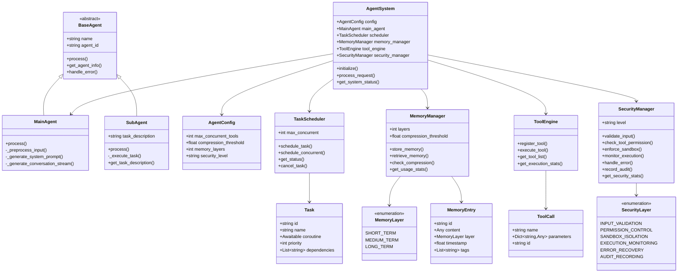

# AI Component Architecture Design

This document provides a comprehensive overview of the AI Component Architecture based on Claude Code's core technical principles. The architecture implements a layered, secure, and efficient system for AI agent orchestration.

## Table of Contents
1. [Architecture Overview](#architecture-overview)
2. [Core Components](#core-components)
3. [Layered Multi-Agent Architecture](#layered-multi-agent-architecture)
4. [Intelligent Task Scheduling](#intelligent-task-scheduling)
5. [Memory Management System](#memory-management-system)
6. [Tool Execution Engine](#tool-execution-engine)
7. [Security Protection Mechanisms](#security-protection-mechanisms)
8. [Data Flow](#data-flow)
9. [Class Diagram](#class-diagram)

## Architecture Overview

The AI Component Architecture is designed around five core principles derived from Claude Code's technical implementation:

1. **Layered Multi-Agent Architecture**: Coordination between a main agent and specialized sub-agents
2. **Intelligent Task Scheduling**: Concurrency control with resource management
3. **Memory Management**: Three-layer memory architecture with intelligent compression
4. **Tool Execution Engine**: Six-stage execution pipeline for secure tool operations
5. **Security Protection**: Six-layer security model for comprehensive protection

```
                    AI Component Architecture
    ┌─────────────────────────────────────────────────────────┐
    │                    Main Agent Layer                      │
    │  ┌─────────────┐         ┌─────────────┐               │
    │  │ Main Agent  │◄────────┤ AgentSystem │               │
    │  │  (Coordination)     │  (Orchestration)             │
    │  └─────────────┘         └─────────────┘               │
    └──────────┬──────────────────────┬───────────────────────┘
               │                      │
    ┌──────────▼──────────────────────▼───────────────────────┐
    │                   Sub-Agent Layer                        │
    │  ┌─────────────┐  ┌─────────────┐  ┌─────────────┐      │
    │  │ SubAgent 1  │  │ SubAgent 2  │  │ SubAgent N  │      │
    │  │ (Specialist) │  │ (Specialist) │  │ (Specialist) │      │
    │  └─────────────┘  └─────────────┘  └─────────────┘      │
    └─────────────────────────────────────────────────────────┘
                              │
    ┌─────────────────────────┼─────────────────────────────────┐
    │          Core Services Layer                             │
    │  ┌─────────────┐  ┌─────────────┐  ┌─────────────┐      │
    │  │  Scheduler  │  │  Memory     │  │   Tools     │      │
    │  │ (Task Mgmt) │  │ (3-Layer)   │  │ (6-Stage)   │      │
    │  └─────────────┘  └─────────────┘  └─────────────┘      │
    │  ┌─────────────┐  ┌─────────────┐                       │
    │  │  Security   │  │   Logging   │                       │
    │  │ (6-Layer)   │  │   (Audit)   │                       │
    │  └─────────────┘  └─────────────┘                       │
    └─────────────────────────────────────────────────────────┘
```

## Core Components

### 1. AgentSystem (`src/core/AgentSystem.py`)
The central orchestrator that manages all other components and processes user requests through the complete pipeline.

### 2. MainAgent (`src/agents/MainAgent.py`)
The primary agent responsible for coordinating the overall processing flow and delegating tasks to sub-agents.

### 3. SubAgent (`src/agents/SubAgent.py`)
Specialized agents for executing specific tasks in isolated environments.

### 4. TaskScheduler (`src/scheduler/TaskScheduler.py`)
Manages concurrent execution of tasks with intelligent scheduling and resource control.

### 5. MemoryManager (`src/memory/MemoryManager.py`)
Implements the three-layer memory architecture with intelligent compression capabilities.

### 6. ToolEngine (`src/tools/ToolEngine.py`)
Executes tools through a secure six-stage pipeline with validation and monitoring.

### 7. SecurityManager (`src/security/SecurityManager.py`)
Provides comprehensive six-layer security protection for all system operations.

## Layered Multi-Agent Architecture

The architecture implements a hierarchical multi-agent system with clear separation of concerns:

### Main Agent Responsibilities
- Overall coordination and orchestration
- Context management and compression triggering
- Task distribution to sub-agents
- Result aggregation and response generation

### Sub-Agent Responsibilities
- Specialized task execution
- Isolated processing environments
- Independent error handling
- Focused result generation

### Communication Model
- One-way communication from main agent to sub-agents
- Asynchronous result reporting
- Shared memory access through MemoryManager
- Security-gated tool execution

## Intelligent Task Scheduling

The TaskScheduler implements concurrency control based on Claude Code's UH1 scheduler:

### Key Features
- Maximum concurrency limit (default: 10 tasks)
- Priority-based task execution
- Resource-aware scheduling
- Dynamic load balancing

### Implementation Details
- Semaphore-based concurrency control
- Task queuing for overflow management
- Priority grouping for efficient execution
- Real-time status monitoring

## Memory Management System

The MemoryManager implements a three-layer architecture inspired by Claude Code's memory system:

### Memory Layers
1. **Short-Term Memory**: Current session context and recent interactions
2. **Medium-Term Memory**: Compressed conversation history using 8-segment structured compression
3. **Long-Term Memory**: Persistent project and user knowledge

### Compression Algorithm (AU2-inspired)
When token usage exceeds 92% threshold:
1. Analyze conversation history for key elements
2. Generate 8-segment structured summary:
   - Background Context
   - Key Decisions
   - Tool Usage Log
   - User Intent Evolution
   - Execution Results
   - Errors and Solutions
   - Open Issues
   - Future Plans
3. Move compressed summary to medium-term layer
4. Clear short-term memory
5. Update token usage counters

## Tool Execution Engine

The ToolEngine implements a secure six-stage execution pipeline:

### Execution Stages
1. **Discovery**: Tool discovery and validation
2. **Validation**: Input validation with schema checking
3. **Permission**: Permission checking and gating
4. **Abort**: Abort signal checking
5. **Execution**: Actual tool execution
6. **Formatting**: Result formatting and cleanup

### Security Features
- Schema-based input validation
- Permission-based execution control
- Abort signal monitoring
- Result sanitization
- Execution auditing

## Security Protection Mechanisms

The SecurityManager implements a comprehensive six-layer protection model:

### Security Layers
1. **Input Validation**: Sanitization and pattern blocking
2. **Permission Control**: Tool and operation permissions
3. **Sandbox Isolation**: Resource and access restrictions
4. **Execution Monitoring**: Resource usage and anomaly detection
5. **Error Recovery**: Secure error handling and recovery
6. **Audit Recording**: Comprehensive security event logging

### Protection Features
- Pattern-based threat detection
- Resource usage monitoring
- Secure error handling
- Compliance auditing
- Real-time threat response

## Data Flow

The complete data flow through the system:

```
User Request
     │
     ▼
┌─────────────┐    ┌─────────────────┐
│ Input       │───▶│ Security Layer 1 │ (Input Validation)
│ Processing  │    │ (Validation)    │
└─────────────┘    └─────────────────┘
     │                     │
     ▼                     ▼
┌─────────────┐    ┌─────────────────┐
│ Memory      │───▶│ Security Layer 2 │ (Permission Control)
│ Management  │    │ (Permissions)   │
└─────────────┘    └─────────────────┘
     │                     │
     ▼                     ▼
┌─────────────┐    ┌─────────────────┐
│ Main Agent  │───▶│ Security Layer 3 │ (Sandbox Isolation)
│ Processing  │    │ (Sandboxing)    │
└─────────────┘    └─────────────────┘
     │                     │
     ▼                     ▼
┌─────────────┐    ┌─────────────────┐
│ Task        │───▶│ Security Layer 4 │ (Execution Monitoring)
│ Scheduling  │    │ (Monitoring)    │
└─────────────┘    └─────────────────┘
     │                     │
     ▼                     ▼
┌─────────────┐    ┌─────────────────┐
│ Tool        │───▶│ Security Layer 5 │ (Error Recovery)
│ Execution   │    │ (Recovery)      │
└─────────────┘    └─────────────────┘
     │                     │
     ▼                     ▼
┌─────────────┐    ┌─────────────────┐
│ Response    │───▶│ Security Layer 6 │ (Audit Recording)
│ Generation  │    │ (Auditing)      │
└─────────────┘    └─────────────────┘
     │                     │
     └─────────────────────┘
     │
     ▼
User Response
```

## Class Diagram



This architecture provides a robust, secure, and scalable foundation for AI agent systems, incorporating the best practices observed in Claude Code's implementation while maintaining flexibility for customization and extension.